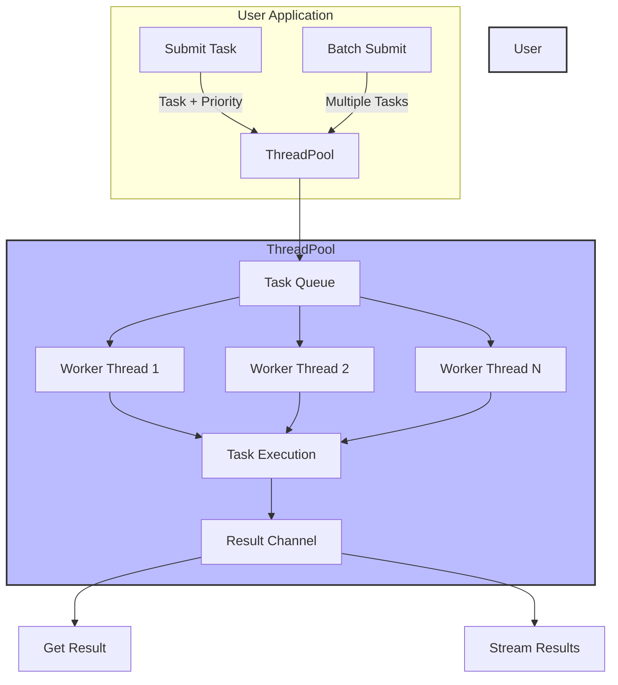

# Tokio Fusion

[](https://crates.io/crates/tokio-fusion)
[](https://docs.rs/tokio-fusion)
[](https://opensource.org/license/apache-2-0)
[](https://github.com/lispking/tokio-fusion/actions?query=branch%3Amain)
[](https://deepwiki.com/lispking/tokio-fusion)

A high-performance thread pool service built on top of Tokio, providing an easy-to-use API for asynchronous task execution.

## Features

- **High Performance**: Built on top of Tokio's efficient runtime
- **Flexible Task Submission**: Submit individual tasks or batches
- **Priority Support**: Assign priorities to tasks
- **Streaming Results**: Stream results as they complete
- **Configurable**: Customize worker threads and queue capacity
- **Error Handling**: Comprehensive error types and handling

## Architecture



The architecture consists of:
1. **ThreadPool**: Manages worker threads and task distribution
2. **Task Queue**: Holds pending tasks with their priorities
3. **Worker Threads**: Execute tasks in parallel
4. **Result Channel**: Delivers execution results back to the caller
5. **Batch Processing**: Allows submitting multiple tasks at once
6. **Streaming Interface**: Provides real-time results as they complete

## Usage

### Basic Example

```rust
use std::sync::Arc;
use tokio_fusion::{ThreadPool, Task, ThreadPoolResult};

async fn my_task(id: usize) -> ThreadPoolResult<String> {
    // Your async task logic here
    Ok(format!("Result from task {id}"))
}

#[tokio::main]
async fn main() {
    // Create a thread pool with default configuration
    let thread_pool = Arc::new(ThreadPool::default());
    
    // Create and submit a task
    let task = Task::new(my_task(1), 1);
    let handle = thread_pool.submit(task).await.unwrap();
    
    // Wait for the result
    let result = handle.await_result().await;
    println!("Task result: {:?}", result);
}
```

### Custom Configuration

```rust
use std::sync::Arc;
use tokio_fusion::ThreadPoolBuilder;

#[tokio::main]
async fn main() {
    // Create a thread pool with custom configuration
    let thread_pool = Arc::new(
        ThreadPoolBuilder::new()
            .worker_threads(8)
            .queue_capacity(1000)
            .build()
    );
    
    // Use the thread pool...
}
```

### Batch Execution

```rust
use std::sync::Arc;
use tokio_fusion::{ThreadPool, BatchExecutor};

#[tokio::main]
async fn main() {
    let thread_pool = Arc::new(ThreadPool::default());
    let mut batch = BatchExecutor::new(Arc::clone(&thread_pool));
    
    // Add tasks to the batch
    for i in 0..5 {
        batch.add_task(my_task(i), i);
    }
    
    // Execute all tasks and collect results
    let results = batch.execute().await;
    
    // Or stream results as they complete
    let mut stream = batch.execute_stream().await;
    while let Some(result) = stream.next().await {
        println!("Got result: {:?}", result);
    }
}
```

## Installation

Add this to your `Cargo.toml`:

```toml
[dependencies]
tokio-fusion = "0.1"
```

## License

This project is licensed under the Apache-2.0 License. See the [LICENSE](LICENSE) file for details.

